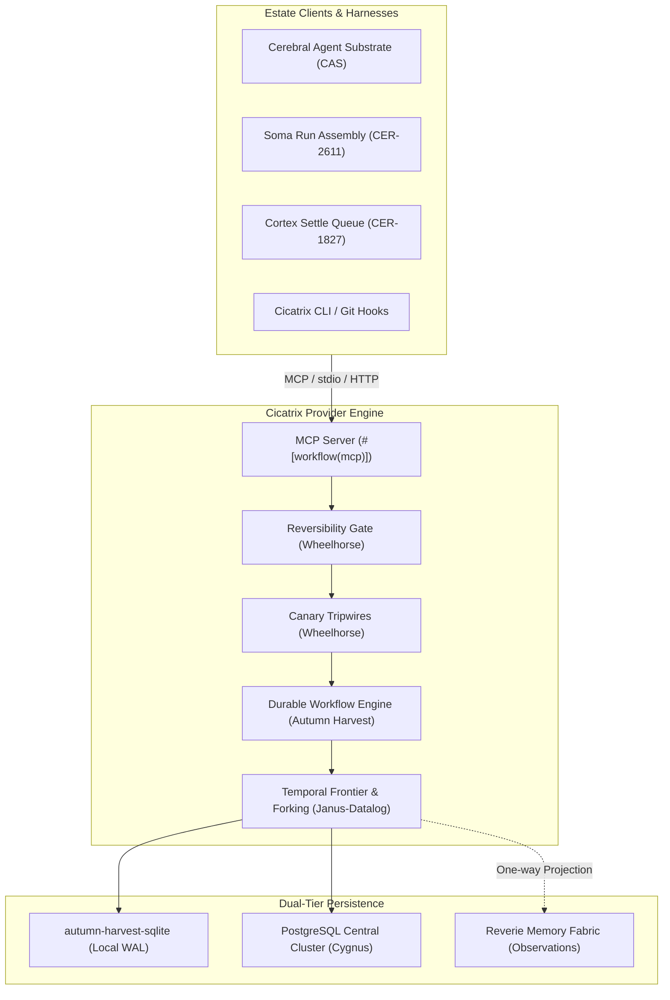
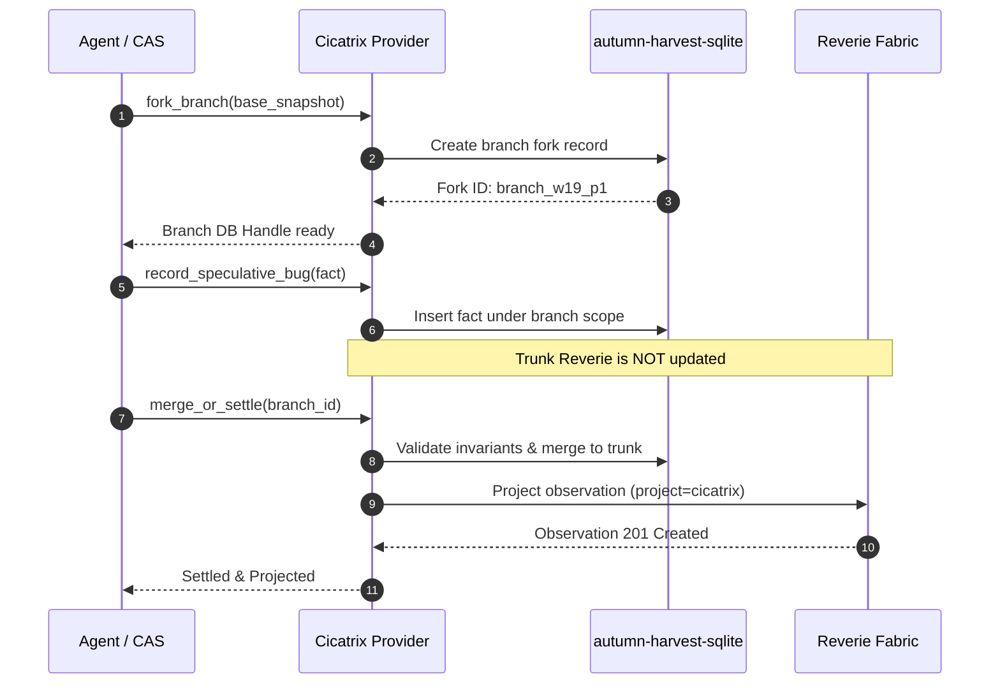
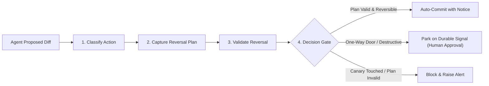

<!-- lineage
role: design
defines: Cicatrix Regression Database Provider Architecture & Implementation Roadmap (Phases 0-4)
consumes: CANON.md, wbrown/janus-datalog, autumn-foundation/autumn-harvest, wheelhorsedev/nexus
-->

# Cicatrix: Regression Database Provider Roadmap

Status: Ratified Architecture and Implementation Roadmap  
Date: 2026-10-09  
Lineage: `CANON.md` · `wbrown/janus-datalog` · `autumn-foundation/autumn-harvest` · `wheelhorsedev/nexus`  
Controlled Language: Conforms to ASD-STE100 principles.  

---

## 1. Executive Summary

This document specifies the roadmap to evolve `cicatrix` from a repository-local markdown projector into an estate-wide **Regression Database Provider**.

Currently, cicatrix projects static markdown files into `reveried` via HTTP search. The evolved system functions as an active provider. It evaluates code regressions, enforces convention invariants, tracks stochastic failures, and gates agent actions across the Cerebral estate.



The system combines three research lineages:
1. **`wbrown/janus-datalog`**: Version-vector temporal frontiers, snapshot database forking, `:db/neverZeroValue` schema integrity, longitudinal stochastic occurrence logs, and `AUTH_LEDGER` review discipline.
2. **`autumn-foundation/autumn-harvest` (Mark Masterson)**: Deterministic event-sourced workflow replay, durable signals with deduplication keys, child workflow DAG scheduling, dual-tier SQLite WAL and PostgreSQL persistence, and native `#[workflow(mcp)]` exposure.
3. **`wheelhorsedev/nexus` (Mark Masterson)**: Reversibility-gated autonomy pipelines (`classify` &rarr; `plan` &rarr; `validate` &rarr; `decide`), synthetic canary tripwires, correlation-masked errors, and the three-tier earned autonomy trust ladder.

---

## 2. Lineage Analysis and Architectural Inputs

### 2.1 Upstream Janus-Datalog Primitives (`wbrown/janus-datalog`)

* **Version-Vector Frontier:** Generalized `AsOf` using Lamport clocks across replicas (`{ReplicaID -> maxLamport}`). Permits historical state reconstruction without mutable overwrites.
* **Snapshot DB Forking:** Creation of isolated branch databases from named snapshots (`DeleteSnapshot` holds no writer locks). Essential for isolated DeltaDB agent worktrees.
* **`:db/neverZeroValue` Constraint:** Absence of a datom differs from a zero value. Schema-level write constraints prevent semantic errors from default empty values.
* **Longitudinal Stochastic Occurrence Logs:** Standardized representation for flaky and timing-sensitive bugs:
  * Measured occurrence history table.
  * Deterministic turnkey reproducer (such as `GOGC=1` or explicit thread clamping).
  * Sanctioned rerun contracts with definitive expiration conditions.
  * Strong closing invariants.
* **Hook Discipline & Transcripts:**
  * `AUTH_LEDGER` protocol: Mandatory scan of user directives before fail-closed reviewer verdicts.
  * Deterministic test evidence extractor (`compute_test_evidence`) targeting Rust modules (`tests/*.rs`, `#[cfg(test)]`).

### 2.2 Autumn Harvest Durable Engine (`autumn-foundation/autumn-harvest`)

* **Deterministic Workflow Replay:** Agent triage and bisection execute inside event-sourced state machines. Host reboots or crashed daemons replay without paying LLM token costs a second time.
* **Durable Signal Architecture:** Human and jury gates suspend execution as durable rows in storage. Delivery deduplicates on `idempotency_key` (migration `20260518000000_harvest_signal_idempotency`). Workflows resume without active polling loops.
* **Dual-Tier Storage Architecture:**
  * `autumn-harvest-sqlite`: Single-writer SQLite backend operating in WAL mode with `synchronous = FULL`. Runs on local developer workstations and edge daemons without external dependencies.
  * Central PostgreSQL: Distributed multi-worker cluster with advisory locks and transactional outbox.
* **Resource Bounds:** Execution capped at 50,000 events and 50 MiB per run. Default activity timeouts enforce a 10-minute upper bound.
* **MCP Integration:** Automatic exposure of durable workflows as MCP endpoints using `#[workflow(mcp)]` and `mcp_tools()`.

### 2.3 Wheelhorse Governance & Reversibility (`wheelhorsedev/nexus`)

* **Reversibility-Gated Autonomy:** Pipeline executes:
  $$\text{Classify} \longrightarrow \text{Capture Reversal Plan} \longrightarrow \text{Validate Plan} \longrightarrow \text{Decide}$$
  * Outward actions proceed autonomously only when a validated compensation or reversal plan exists.
  * Compensation actions must not create one-way doors (e.g., delete compensates via soft-delete recycling).
* **Canary Tripwires:** Synthetic sentinel records (`tripwire_canaries`) seeded within the regression database. Any read or write by an unapproved agent tripwire logs a security alert and freezes the session.
* **Masked Error Policy:** Internal server errors (5xx) across CLI, REST, and MCP surfaces return a generic message with a `ref_`-prefixed correlation identifier. No internal stack traces or secrets leak.
* **Earned Autonomy Trust Ladder:** Three levels per capability:
  1. `shadow`: Proposes fixes silently alongside human runs.
  2. `supervised`: Stages regression entries and patches for explicit approval.
  3. `autonomous`: Executes within verified blast-radius guardrails.

---

## 3. The Target State: Cicatrix as a Provider

When implemented, Cicatrix acts as a centralized regression engine with four core capabilities:

1. **Query & Blast-Radius Engine:** Harnesses query Cicatrix during run assembly (`soma` Leg 1, CER-2611). Cicatrix resolves touched paths against known defect surfaces and returns verified historical failure modes.
2. **Speculative Branch Provider:** During agent branch execution, Cicatrix forks a lightweight database snapshot. The agent records speculative regressions and validates invariants without mutating trunk memory.
3. **Durable Triage Orchestrator:** CI failures or regression reports spawn Autumn Harvest workflows. The workflow bisects git history, executes candidate tests, isolates reproducers, and pauses on a durable signal for operator approval.
4. **Reversibility & Integrity Sentinel:** Cicatrix inspects proposed code edits. It verifies that automated reversal scripts exist and checks that no synthetic tripwire canaries were touched.

---

## 4. Phase-by-Phase Implementation Roadmap

### Phase 0: Groundwork, Schema Rigor & Hook Port (v0.2)
**Goal:** Align existing local markdown corpus and reviewer hooks with upstream Janus-Datalog discipline.

* [ ] **Milestone 0.1: Port Upstream Janus Review Hooks**
  * Port `AUTH_LEDGER` full-transcript scanner (`lib/auth_ledger.jq`) to prevent reviewer over-blocking.
  * Adapt `compute_test_evidence` for Rust test discovery (`tests/*.rs`, inline `mod tests`).
  * Integrate Review-Edit Mode 9 (comment truth-check and code-comment contradiction detection).
* [ ] **Milestone 0.2: Schema Constraint Implementation (`:db/neverZeroValue`)**
  * Update `src/bug_md.rs` and `_SCHEMA.md` to disallow zero-value ambiguities. Empty strings, null collections, and missing fields must be distinct.
  * Enforce strict validation on parser boundaries. Reject invalid schema states fail-closed.
* [ ] **Milestone 0.3: Stochastic Failure Formalization**
  * Complete full ingestion support for `reproducer` turnkey triggers.
  * Parse occurrence log tables into structured `BugFact` records.
  * Add validation for sanctioned rerun policies and closing invariants.

### Phase 1: Dual-Tier Persistence & Temporal Frontier Engine (v0.3)
**Goal:** Replace ephemeral in-memory searches with persistent storage supporting branch snapshots and time-travel.

* [ ] **Milestone 1.1: Embedded Storage Integration (`autumn-harvest-sqlite`)**
  * Add `autumn-harvest-sqlite` crate dependency.
  * Initialize local regression database at `~/.cicatrix/cicatrix.db` in SQLite WAL mode with `synchronous = FULL`.
  * Maintain `src/reverie.rs` bridge as a regenerable secondary projection.
* [ ] **Milestone 1.2: Version-Vector Frontier Engine**
  * Replace the scalar Git ancestry check in `src/gitf.rs` with a multi-replica version-vector `Frontier`.
  * Support `query --frontier <vector>` and `query --as-of <commit>`.
* [ ] **Milestone 1.3: Branch Snapshot & Forking Interface**
  * Implement `cicatrix branch fork <snapshot_id>` to generate isolated branch database instances.
  * Provide lock-free snapshot deletion for transient agent DeltaDB virtual workspaces.



### Phase 2: Durable Workflow Orchestration & MCP Server (v0.4)
**Goal:** Expose regression services as durable event-sourced workflows over the Model Context Protocol.

* [ ] **Milestone 2.1: Autumn Harvest Workflow Engine Integration**
  * Define core regression workflows:
    * `RegressionTriageWorkflow`: Ingests test failure &rarr; bisects commits &rarr; isolates minimal repro.
    * `ConventionAuditWorkflow`: Executes cross-repo marker scans across the estate.
  * Configure 10-minute activity timeouts and exponential backoff retry policies.
* [ ] **Milestone 2.2: Durable Signal Review Gates**
  * Implement `Signal<OperatorVerdict>` with deduplication using `idempotency_key`.
  * Support mid-flight workflow parking when an ambiguous defect or unverified fix requires human intervention.
  * Ensure zero CPU and zero token consumption during parked state.
* [ ] **Milestone 2.3: Native MCP Provider Interface**
  * Annotate workflow endpoints with `#[workflow(mcp)]` and export via `mcp_tools()`.
  * Mount MCP server on both stdio (for local agents) and streamable HTTP (for cluster runners).
  * Expose tools: `cicatrix_query_known_bugs`, `cicatrix_verify_diff`, `cicatrix_record_defect`.

### Phase 3: Wheelhorse Reversibility Rails & Canary Tripwires (v0.5)
**Goal:** Enforce safety boundaries on agent mutations and detect unauthorized regression modifications.

* [x] **Milestone 3.1: Reversibility Pipeline (`crm-core-reversibility` / `CER-2759`)**
  * Implemented the 4-stage decision pipeline in Rust (`src/reversibility/`):
    * `classify`: Determine whether touched surfaces are reversible (code edits, test additions) or one-way doors (migration drops, secret rotations), detecting sentinel tripwires.
    * `capture_plan`: Machine-generate or validate the compensation plan / reversal action with inverse diffs.
    * `validate`: Execute the rollback in a speculative sandbox; confirm clean baseline restoration and zero uncompensated side effects.
    * `decide`: Return `AutoCommit`, `AutoCommitWithNotice`, `RouteToApproval`, or `Block` based on autonomy ladder tier (`Shadow`, `Supervised`, `Autonomous`).
  * Wired CLI subcommand `cicatrix reversibility <eval|classify|plan|validate>` and MCP tool `cicatrix_verify_reversibility`.
* [x] **Milestone 3.2: Synthetic Canary Tripwire Registry (`crm-core-tripwire` / `CER-2760`)**
  * Seeded synthetic regression entries (`tripwire_canaries`) in the database with known sentinel markers and `:db/neverZeroValue` validation.
  * Implemented `tripwire_touches` audit logging table to capture actor, action type, verdict, and notification status.
  * Enforced immediate fail-closed circuit breaking and Cortex security notifications (`cortex-msg send coordinator "security:canary-tripwire"`) upon unauthorized agent touch.
  * Added `cicatrix tripwire <list|check|touches|seed>` CLI command, guarded `cicatrix query` and `cicatrix reversibility`, and exposed `cicatrix_check_tripwire` MCP tool with fail-closed query/diff guards.
* [ ] **Milestone 3.3: Unified Error Masking**
  * Mask all 5xx internal server errors across CLI, REST, and MCP surfaces behind `ref_`-prefixed identifiers.
  * Strip internal file paths and credentials from error responses.



### Phase 4: Earned Autonomy Trust Ladder & Estate Integration (v1.0)
**Goal:** Connect Cicatrix as an estate-wide provider across Cortex, Soma, and cluster nodes.

* [ ] **Milestone 4.1: Earned Autonomy Trust Ladder**
  * Implement three capability levels: `shadow`, `supervised`, and `autonomous`.
  * Maintain an append-only audit ledger of capability promotion events.
  * Enforce the estate invariant: Soma gates default strictly to human operator verdicts; earned autonomy applies only to background operational tasks and speculative sandboxes.
* [ ] **Milestone 4.2: Soma Run-Context Assembly Integration (CER-2611)**
  * Wire Cicatrix MCP query directly into Soma run context assembly (`blackwall-cli/src/run.rs`).
  * Prepend `<known-bugs>` guidance to task prompts automatically before execution begins.
* [ ] **Milestone 4.3: Cortex Settle Learning Loop (CER-1827)**
  * Subscribe Cicatrix to the Cortex settle outbox stream.
  * Ingest negative settle verdicts as observed defect facts (`docs/sessions/observed/`).
* [ ] **Milestone 4.4: Log-Segment Shipping Replication**
  * Implement `(SinceTx, UntilTx]` windowed log shipping.
  * Synchronize regression database state between local workstations (`ceres`) and cluster nodes (`cygnus`) across the Tailscale mesh.

---

## 5. Technical Specification & Data Contracts

### 5.1 Extended Regression Fact Model

```rust
/// Core regression fact stored in the temporal provider engine.
#[derive(Debug, Clone, Serialize, Deserialize)]
pub struct RegressionFact {
    /// Canonical defect slug (e.g., "BUG_REVERIED_UNBOUNDED_SHUTDOWN_SIGKILL").
    pub id: String,
    /// Touched file paths with optional line ranges.
    pub files: Vec<String>,
    /// Observable symptom description.
    pub symptom: String,
    /// Root cause classification.
    pub root_cause: String,
    /// Commit SHA introducing the verified fix.
    pub fix_commit: String,
    /// Path to executable regression test.
    pub regression_test: String,
    /// Roll-up meta-pattern category.
    pub meta_pattern: String,
    /// Blast-radius directory prefix.
    pub scope: Option<String>,
    /// Stochastic reproduction details (empty if deterministic).
    pub stochastic: Option<StochasticSpec>,
    /// Lamport timestamp and replica identifier.
    pub frontier_stamp: FrontierStamp,
}

/// Specifications for stochastic or timing-sensitive failures.
#[derive(Debug, Clone, Serialize, Deserialize)]
pub struct StochasticSpec {
    /// Turnkey environment variable or command-line reproducer.
    pub reproducer_command: String,
    /// Historical occurrence log entries.
    pub occurrence_log: Vec<OccurrenceEntry>,
    /// Sanctioned rerun conditions and policy.
    pub rerun_policy: String,
    /// Definite closing invariant.
    pub closing_invariant: String,
}

#[derive(Debug, Clone, Serialize, Deserialize)]
pub struct OccurrenceEntry {
    pub date: String,
    pub environment: String,
    pub run_count: u32,
    pub failure_count: u32,
    pub citation: String,
}
```

### 5.2 Reversibility Action Pipeline Contract

```rust
#[derive(Debug, Clone, Serialize, Deserialize)]
pub enum ActionClass {
    /// Pure additive read or safe temporary write.
    ReversibleAdditive,
    /// Modification with exact automated inverse operation.
    ReversibleWithPlan { rollback_script: String },
    /// Non-reversible or state-destroying mutation.
    OneWayDoor { reason: String },
}

#[derive(Debug, Clone, Serialize, Deserialize)]
pub enum ReversibilityVerdict {
    /// Action executes autonomously.
    AutoCommit,
    /// Action executes autonomously; notice recorded in journal.
    AutoCommitWithNotice { notice: String },
    /// Action halts; requires durable approval signal.
    RouteToApproval { signal_name: String, timeout_seconds: u64 },
    /// Action rejected immediately.
    Block { violation: String },
}
```

### 5.3 MCP Toolset Definitions

| Tool Name | Parameters | Description |
|---|---|---|
| `cicatrix_query_known_bugs` | `paths: Vec<String>`, `limit: u32`, `frontier: Option<String>` | Returns active bug facts and meta-patterns covering the specified paths. |
| `cicatrix_verify_reversibility` | `diff_patch: String`, `target_repo: String` | Evaluates proposed diff against the reversibility pipeline and canary checks. |
| `cicatrix_fork_branch_db` | `base_snapshot: String`, `branch_name: String` | Generates an isolated branch database snapshot for virtual workspace runs. |
| `cicatrix_record_regression` | `fact: RegressionFact`, `idempotency_key: String` | Queues a verified bug fact into the durable ingestion workflow. |
| `cicatrix_submit_verdict_signal` | `workflow_id: String`, `verdict: String`, `idempotency_key: String` | Dispatches an approval signal to a parked triage workflow. |

---

## 6. Verification and Risk Analysis

### 6.1 Verification Gates

1. **Deterministic Test Discovery:** Run `cargo test -j 2` across all tests. Verify that every regression fact contains a runnable test file.
2. **Crash Replay Fidelity:** Simulate unexpected SIGKILL against `autumn-harvest` during an active regression triage workflow. Restart worker process; confirm execution resumes without re-evaluating completed activities.
3. **Tripwire Detection Assertion:** Execute a test script that touches a registered `tripwire_canaries` entry. Confirm that:
   * The operation immediately fails.
   * A security alert is broadcast to Cortex mesh channels.
   * The offending session is blocked.
4. **Reversibility Plan Integrity:** Generate a destructive schema drop patch. Verify that the reversibility gate classifies it as `OneWayDoor` and rejects autonomous execution.

### 6.2 Primary Risks and Mitigations

| Risk | Impact | Mitigation Strategy |
|---|---|---|
| **Database Contention on Ceres:** Multiple agents querying SQLite concurrently causes write lock timeouts. | Agent tasks fail or wait indefinitely. | Maintain WAL mode with busy timeout set to 5000ms. Keep write transactions under 10ms. Perform long workflows in PostgreSQL. |
| **False-Positive Gate Blocks:** Reviewer hooks block valid user-authorized changes. | Agent loop halts; developer friction increases. | Scan full transcript using `AUTH_LEDGER` protocol before evaluating fail-closed rules. |
| **Canary Leakage to Context:** Synthetic canaries included in agent prompts confuse generation. | Agent produces invalid code or alerts. | Isolate tripwire tables from standard query paths; scan only during mutation boundary verification. |
| **Token Cost Runaways:** Automatic bisection loops execute unbounded LLM turns. | High PaaS model costs. | Cap workflows at 50,000 events and 50 MiB. Impose hard 10-minute activity timeouts and maximum 3 bisection steps per run. |
